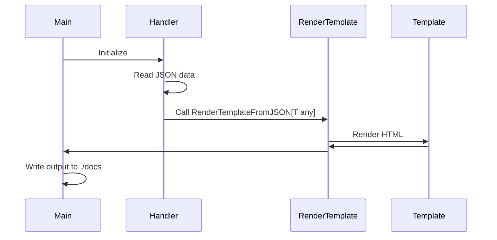

# Personal Website Generator

A simple static site generator for my personal website.

The goal is to quickly and easily generate a deployable static website while keeping things simple (KISS principle).

Go was chosen because it is fast, type-safe, and its standard library provides template rendering. No additional frameworks or dependencies are required.

## Personal Website

**PC**

<p align="center">
  
</p>

**Mobile**

<p align="center">
  
</p>

[**Link**](https://avengerandy.github.io/personal/index.html)

## Architecture

The generator follows a clear flow:

```
JSON → Handler → Template → Docs
```

### Component Overview

* **Main**: Iterates through all handlers and generates HTML files.
* **Handler**: Reads JSON and passes data to templates.
* **RenderTemplateFromJSON[T any]**: Generic function that renders templates from any JSON-defined struct type.
* **Template**: HTML templates with placeholders for JSON data.

### Sequence


## Build & Deployment

### Requirements

- Go 1.22 (or compatible version)

### Generate Site

```bash
go run main.go
```

All HTML files are generated in the ./docs folder, ready for deployment.
